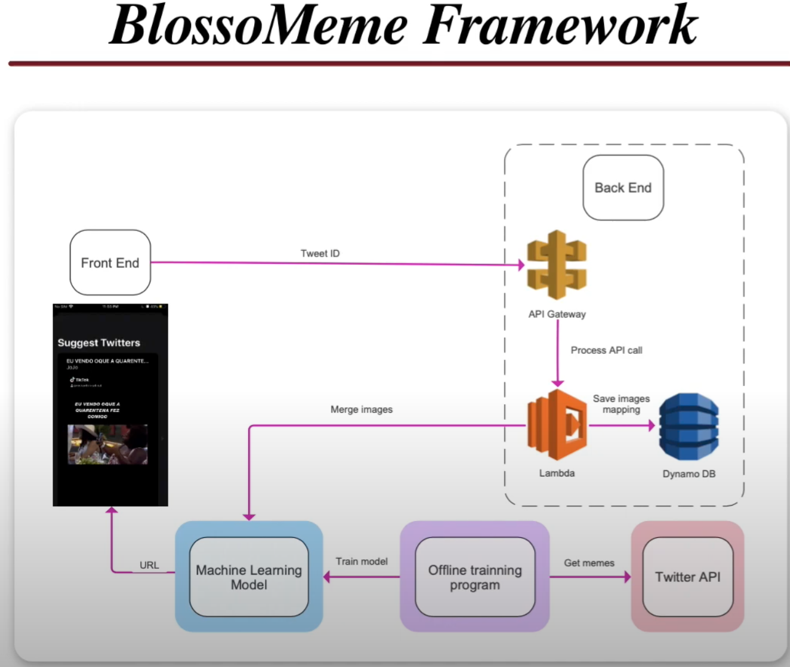
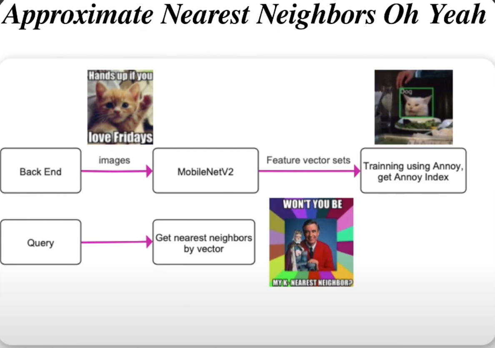
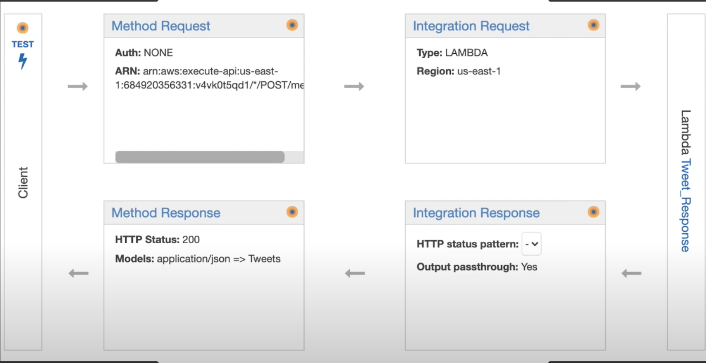
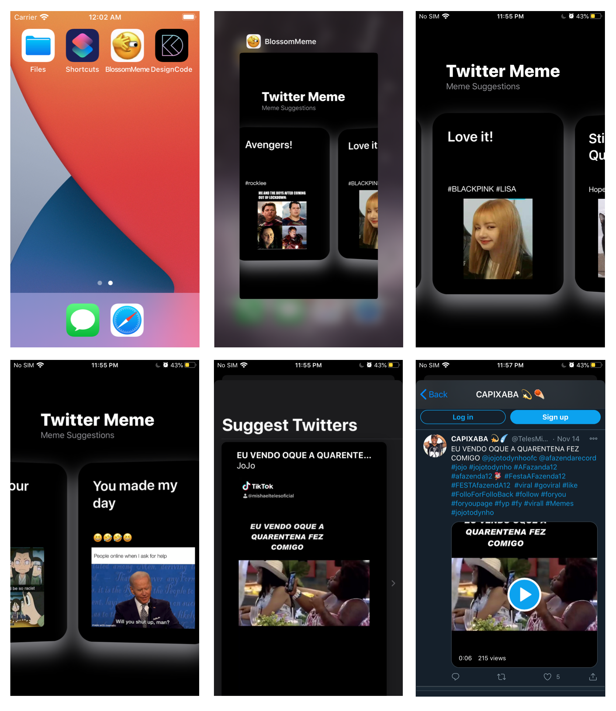

# BlossoMeme

-------------------------

#### **Twitter Hackathon**

#### [Devpost](https://devpost.com/software/blossomeme?ref_content=user-portfolio&ref_feature=in_progress) &[Demo](https://www.youtube.com/watch?v=dUHvLKlVRXk&feature=youtu.be) 

By Andy Yang, Blossom Yin, Justin Sun, Steve Huang, Vivian Wang

----------------

# FRAMWORK

**Build up a backend service to connect lambda to Machine learning model **

- **AWS API gateway**
- **AWS Lambda**
- **Dynamo DB**

## ML MODEL

**Annoy (Approximate Nearest Neighbors Oh Yeah)**

**For our image search algorithm, there are two main parts:**

-  feature vector generation
  -  we utilize a pretrained model MobileNetV2 available at TF hub based on inverted residuals and linear bottlenecks that is proven to be effective on multiple tasks and benchmarks as well as across a spectrum of different model sizes. 
- the nearest neighbour search. 
  - After fetching the feature vectors, we perform nearest neighbour search among them to find the memes we are searching for. In particular, we utilize the spotify/annoy packet, usd by Spotify for their music recommendation, to perform nearest neighbour search. [Annoy](http://en.wikipedia.org/wiki/Nearest_neighbor_search#Approximate_nearest_neighborhas) the advantage of fast speed and small memory usage and is proven to be of high performance in high-dimensional space, a perfect match for our task.

# API GATEWAY

**Front will send tweet ID to back end’s api gateway. On the backend side. We deployed the service to AWS. Our AWS API Gateway will accept a meme image url as request and integrate the input with the machine learning model to get the top 5 most relevant tweets. Then we return the response to the front end.**

# IOS CLIENT

**for the front end, we built our app on iOS platform using Swift UI to implement a friendly user interface for getting the relevant tweets. And we set this cute image as our icon.**

